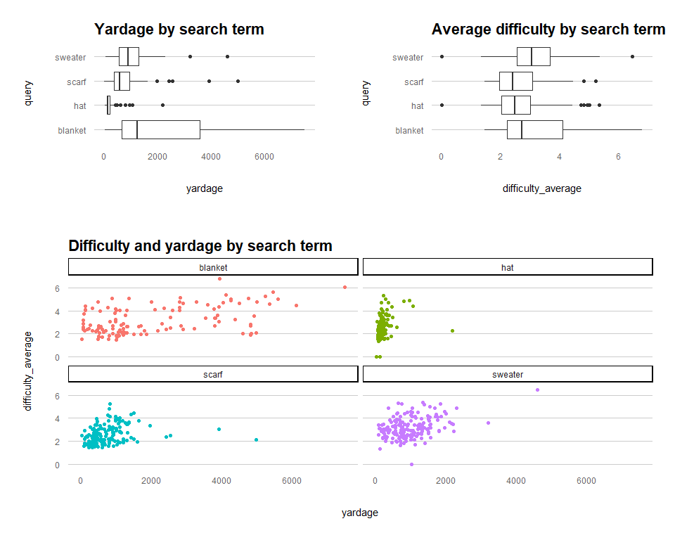

Nested Modeling
================

Let’s begin by generating some data using the `ravelRy` package, which
makes knitting and crochet patterns available via Ravelry.com’s API. You
can follow the steps
[here](https://www.kaylinpavlik.com/introducing-new-r-package-ravelry/)
for installing the package, creating a Ravelry developer account and
authenticating via the package.

To create a dataset, let’s pass four different search terms to the
`ravelRy::search_patterns` function: `scarf`, `hat`, `sweater`, and
`blanket`. For each, let’s restrict to crochet patterns, sort by
popularity, and retrieve the top 200. You can do this using
[`purrr::map`](https://purrr.tidyverse.org/reference/map.html) by
storing the query in a text column and then passing it to the search
function using map. This returns a 4x2 dataframe: a row for each of the
4 queries and two columns: `query` and `results.` `results` is a
list-column which can be unnested. The returned ids can then be used to
get pattern details using the function `ravelRy::get_patterns`.

``` r
# queries <- data.frame(query = c('scarf', 'hat', 'sweater', 'blanket')) %>%
#   mutate(results = map(query, ~ search_patterns(query     = ., 
#                                                 craft     = 'crochet', 
#                                                 page_size = 200, 
#                                                 sort      = 'popularity')))
# 
# ids <- queries %>%
#   unnest(results)
# 
# pattern_details <- get_patterns(ids = ids$id) 
# 
# patterns <- ids %>%
#   select(query, id) %>%
#   left_join(pattern_details, by = 'id') %>%
#   mutate(yardage = as.numeric(yardage)) %>%
#   filter(!is.na(yardage), !is.na(difficulty_average))

#write.csv(patterns[,-c(34,40,43:51)], 'patterns.csv')
patterns <- read.csv('patterns.csv')
```

The relationship of interest here is the impact of pattern yardage on
the average pattern difficulty score. Are bigger projects also harder?

``` r
yardage_boxplot <- patterns %>%
  ggplot(aes(x = yardage, y = query)) + 
  geom_boxplot() + 
  labs(title = 'Yardage by search term')

difficulty_boxplot <- patterns %>%
  ggplot(aes(x = difficulty_average, y = query)) + 
  geom_boxplot() +
  labs(title = 'Average difficulty by search term')

yardage_difficulty_scatter <- patterns %>%
  ggplot(aes(x = yardage, y = difficulty_average, color = query)) + 
  geom_point() + 
  facet_wrap(~query) +
  labs(title = 'Difficulty and yardage by search term') +
  theme(legend.position = 'none')

gridExtra::grid.arrange(yardage_boxplot, difficulty_boxplot, yardage_difficulty_scatter, 
                        padding = unit(0.15, "line"),
                        heights = c(2,3),
                        layout_matrix = rbind(c(1,2), c(3)))
```

<!-- -->

Next, we can nest the data under each query, split into training and
testing subsets, fit the a linear regression model, and calculate
predictions using `purrr::map`.

``` r
set.seed(1234)
nested_patterns <- patterns %>%
  select(query, id, yardage, difficulty_average) %>% 
  nest(-query) %>%
  mutate(split = map(data, ~initial_split(., prop = 8/10)),
         train = map(split, ~training(.)),
         test  = map(split, ~testing(.)))

nested_fit <- nested_patterns %>%
  mutate(fit   = map(train, ~lm(difficulty_average ~ yardage, data = .)),
         pred  = map2(.x = fit, .y = test, ~predict(object = .x, newdata = .y))) 
```

There is a lot to unpack here\! First, I reduced the data down to just
the columns of interest, and then nested them within the `query` value.
You could also think about this as creating a single row for each of the
four `query` values and sticking all the according data into a
list-column called `data`. From there, you can manipulate that
list-column using `map`.

Next, I split each query’s `data` into 80% training, 20% testing using
`rsample::initial_split`; created the training data using
`rsample::training` and the testing data using `rsample::testing`; and
fit the linear model using `lm`. Each step uses `map` to pass a
list-column into a function. Finally, I used `map2` to pass 2
list-columns into the `predict` function. Here’s what it (a row for each
query and 6 list-columns) ends up looking like:

``` r
nested_fit 
```

    ## # A tibble: 4 x 7
    ##   query   data           split         train         test         fit   pred    
    ##   <chr>   <list>         <list>        <list>        <list>       <lis> <list>  
    ## 1 scarf   <tibble [162 ~ <split [130/~ <tibble [130~ <tibble [32~ <lm>  <dbl [3~
    ## 2 hat     <tibble [129 ~ <split [104/~ <tibble [104~ <tibble [25~ <lm>  <dbl [2~
    ## 3 sweater <tibble [172 ~ <split [138/~ <tibble [138~ <tibble [34~ <lm>  <dbl [3~
    ## 4 blanket <tibble [123 ~ <split [99/2~ <tibble [99 ~ <tibble [24~ <lm>  <dbl [2~

To view the fit for each model, the function `broom::glance` can be
mapped to each `fit` and unnested.

``` r
nested_fit %>%
  mutate(glanced = map(fit, glance)) %>%
  select(query, glanced) %>%
  unnest(glanced)
```

    ## # A tibble: 4 x 13
    ##   query r.squared adj.r.squared sigma statistic p.value    df logLik   AIC   BIC
    ##   <chr>     <dbl>         <dbl> <dbl>     <dbl>   <dbl> <dbl>  <dbl> <dbl> <dbl>
    ## 1 scarf    0.0496        0.0421 0.777      6.68 1.09e-2     1  -151.  307.  316.
    ## 2 hat      0.0770        0.0680 0.881      8.51 4.35e-3     1  -133.  273.  281.
    ## 3 swea~    0.172         0.165  0.821     28.2  4.43e-7     1  -168.  341.  350.
    ## 4 blan~    0.184         0.176  1.09      21.9  9.45e-6     1  -148.  303.  310.
    ## # ... with 3 more variables: deviance <dbl>, df.residual <int>, nobs <int>

Based on the scatterplot, the first thing I would try to fix the low
adjusted R2 is to assess and remove any outliers. We can do that by
mapping the function `broom::augment` to each `fit`, unnesting, and
sorting by `.cooksd`. Cook’s D is a measure of the leverage that a given
point has on the regression fit. If the value is \> 1, we should remove
it.

``` r
nested_fit %>%
  mutate(augmented = map(fit, augment)) %>%
  select(query, augmented) %>%
  unnest(augmented) %>%
  arrange(desc(.cooksd)) %>%
  head()
```

    ## # A tibble: 6 x 9
    ##   query difficulty_aver~ yardage .fitted .resid .std.resid   .hat .sigma .cooksd
    ##   <chr>            <dbl>   <int>   <dbl>  <dbl>      <dbl>  <dbl>  <dbl>   <dbl>
    ## 1 hat               2.23    2184    4.61 -2.38       -4.39 0.622   0.798 15.9   
    ## 2 scarf             2.10    4984    3.80 -1.70       -2.74 0.365   0.757  2.16  
    ## 3 swea~             6.45    4593    5.32  1.13        1.58 0.235   0.817  0.384 
    ## 4 hat               4.92     960    3.36  1.56        1.87 0.0971  0.871  0.188 
    ## 5 hat               4.42    1060    3.46  0.962       1.17 0.122   0.880  0.0945
    ## 6 blan~             6.07    7500    4.77  1.29        1.25 0.104   1.09   0.0906

``` r
# cutoff 1
outliers <- nested_fit %>%
  mutate(augmented = map(fit, augment)) %>%
  select(query, augmented) %>%
  unnest(augmented) %>%
  arrange(desc(.cooksd)) %>%
  filter(.cooksd > 1)

nested_patterns_trimmed <- nested_patterns %>%
  unnest(train) %>%
  anti_join(outliers, by = c('query', 'difficulty_average', 'yardage')) %>%
  nest(train = -c(query, data, split, test))
```

There are 2 points with great leverage, a hat with 2,184 yards/2.23
difficulty, and a scarf with 4,984 yards/2.10 difficulty. Let’s remove
both and refit the models.

``` r
nested_fit_trimmed <- nested_patterns_trimmed %>% 
  mutate(fit   = map(train, ~lm(difficulty_average ~ yardage, data = .)),
         pred  = map2(.x = fit, .y = test, ~predict(object = .x, newdata = .y))) 

nested_fit_trimmed %>%
  mutate(glanced = map(fit, glance)) %>%
  select(query, glanced) %>%
  unnest(glanced)
```

    ## # A tibble: 4 x 13
    ##   query r.squared adj.r.squared sigma statistic p.value    df logLik   AIC   BIC
    ##   <chr>     <dbl>         <dbl> <dbl>     <dbl>   <dbl> <dbl>  <dbl> <dbl> <dbl>
    ## 1 scarf     0.103        0.0956 0.757      14.5 2.14e-4     1  -146.  298.  307.
    ## 2 hat       0.250        0.243  0.798      33.8 7.30e-8     1  -122.  250.  258.
    ## 3 swea~     0.172        0.165  0.821      28.2 4.43e-7     1  -168.  341.  350.
    ## 4 blan~     0.184        0.176  1.09       21.9 9.45e-6     1  -148.  303.  310.
    ## # ... with 3 more variables: deviance <dbl>, df.residual <int>, nobs <int>

The adjusted R2 improved quite a bit for `scarf` (0.04 -\> 0.09) and
`hat` (0.06 -\> 0.24) due to removing those outliers with high leverage.
Next let’s inspect the coefficients.

``` r
nested_fit_trimmed %>%
  mutate(augmented = map(fit, augment)) %>% 
  select(query, augmented) %>%
  unnest(augmented) %>%
  arrange(desc(.cooksd)) %>%
  filter(.cooksd > 1)
```

    ## # A tibble: 0 x 9
    ## # ... with 9 variables: query <chr>, difficulty_average <dbl>, yardage <int>,
    ## #   .fitted <dbl>, .resid <dbl>, .std.resid <dbl>, .hat <dbl>, .sigma <dbl>,
    ## #   .cooksd <dbl>

``` r
  ## none

nested_fit_trimmed %>%
  mutate(tidied = map(fit, tidy)) %>%
  select(query, tidied) %>%
  unnest(tidied)
```

    ## # A tibble: 8 x 6
    ##   query   term        estimate std.error statistic  p.value
    ##   <chr>   <chr>          <dbl>     <dbl>     <dbl>    <dbl>
    ## 1 scarf   (Intercept) 2.23     0.117         19.0  6.78e-39
    ## 2 scarf   yardage     0.000510 0.000134       3.81 2.14e- 4
    ## 3 hat     (Intercept) 2.01     0.128         15.7  8.27e-29
    ## 4 hat     yardage     0.00299  0.000514       5.81 7.30e- 8
    ## 5 sweater (Intercept) 2.66     0.128         20.7  6.24e-44
    ## 6 sweater yardage     0.000578 0.000109       5.31 4.43e- 7
    ## 7 blanket (Intercept) 2.56     0.176         14.6  3.71e-26
    ## 8 blanket yardage     0.000295 0.0000630      4.68 9.45e- 6

Despite low R2 for the models, the coefficients are all significant. How
good are they at predicting the test set values?

``` r
nested_fit_evaluate <- nested_fit_trimmed %>%
  select(query, test, pred) %>%
  unnest(test, pred)

nested_fit_evaluate %>%
  group_by(query) %>%
  summarise(total_ss = sum((difficulty_average - mean(difficulty_average))^2),
            residual_ss = sum((difficulty_average - pred)^2),
            n = n(),
            .groups = 'drop') %>%
  mutate(r.squared = 1 - (residual_ss/total_ss),
         adj.r.squared = 1 - (((1-r.squared)*(n-1))/(n-1-1)))
```

    ## # A tibble: 4 x 6
    ##   query   total_ss residual_ss     n r.squared adj.r.squared
    ##   <chr>      <dbl>       <dbl> <int>     <dbl>         <dbl>
    ## 1 blanket     29.6        18.8    24    0.365        0.336  
    ## 2 hat         17.3        12.3    25    0.289        0.259  
    ## 3 scarf       16.1        13.9    32    0.132        0.103  
    ## 4 sweater     30.0        29.1    34    0.0290      -0.00135

The `blanket`, `hat` and `scarf` models do a pretty good job of
predicting the test set values, but `sweater` is poor.

#### Comparing to a single model

How does nested data linear models compare to one large model where the
nesting value is a categorical indepedent variable? It is the same\!

``` r
set.seed(2345)
split <- initial_split(patterns, prop = 8/10, strata = query)
pattern_train <- training(split)
pattern_test <- testing(split) 

fit <- lm(difficulty_average ~ yardage*query, data = pattern_train)

fit %>% 
  tidy()
```

    ## # A tibble: 8 x 5
    ##   term                   estimate std.error statistic  p.value
    ##   <chr>                     <dbl>     <dbl>     <dbl>    <dbl>
    ## 1 (Intercept)           2.42      0.135        17.9   5.87e-55
    ## 2 yardage               0.000340  0.0000499     6.80  3.21e-11
    ## 3 queryhat             -0.0481    0.177        -0.272 7.86e- 1
    ## 4 queryscarf           -0.0484    0.180        -0.269 7.88e- 1
    ## 5 querysweater          0.163     0.192         0.849 3.97e- 1
    ## 6 yardage:queryhat      0.000750  0.000340      2.21  2.79e- 2
    ## 7 yardage:queryscarf   -0.0000650 0.000132     -0.493 6.22e- 1
    ## 8 yardage:querysweater  0.000261  0.000127      2.05  4.06e- 2

In a linear regression model like this with a single
continuous/categorical interaction term, you can tease out the
individual intercepts/slopes for each level of the factor like this.

Y = B0 + B1*yardage + B2*query + B3*yardage*query

The query term is simply 1 for the query level you are looking at, and 0
for all others, so for example, “hat” would be

Y = 2.42447743997 + 0.00033963339*yardage + -0.04806351306*(hat = 1) +
-0.04844096350(scarf = 0) + -0.16263488664(sweater = 0) +
0.00075042692*(hat = 1)*yardage + -0.00006500389*(scarf = 0)*yardage +
0.00026058140*(sweater = 0)*yardage

(the missing term, ‘blanket’, is the base term, so its formula would
simply by Y = B0 + B1\*yardage)

All the query terms other than hat turn to zeroes, so

Y = 2.42447743997 + 0.00033963339*yardage + -0.04806351306*1 +
0.00075042692*1*yardage

Then you can move things around to be

Y = (2.42447743997 + -0.04806351306) + (0.00033963339 +
0.00075042692)\*yardage

So the fitted formula for `hat` is

Y = 2.376414 + 0.00109006\*yardage

``` r
nested_fit_test <- pattern_train %>%
  select(query, id, yardage, difficulty_average) %>%
  nest(-query) %>%
  mutate(fit = map(data, ~lm(difficulty_average ~ yardage, data = .)))

nested_fit_test %>%
  mutate(tidied = map(fit, tidy)) %>% 
  select(query, tidied) %>% 
  unnest(tidied)
```

    ## # A tibble: 8 x 6
    ##   query   term        estimate std.error statistic  p.value
    ##   <chr>   <chr>          <dbl>     <dbl>     <dbl>    <dbl>
    ## 1 scarf   (Intercept) 2.38     0.105         22.7  1.07e-46
    ## 2 scarf   yardage     0.000275 0.000107       2.56 1.17e- 2
    ## 3 hat     (Intercept) 2.38     0.116         20.6  4.45e-38
    ## 4 hat     yardage     0.00109  0.000341       3.20 1.85e- 3
    ## 5 sweater (Intercept) 2.59     0.124         20.8  4.71e-44
    ## 6 sweater yardage     0.000600 0.000107       5.61 1.07e- 7
    ## 7 blanket (Intercept) 2.42     0.165         14.7  2.39e-26
    ## 8 blanket yardage     0.000340 0.0000610      5.56 2.34e- 7

Which matches the nested model fit, where `(Intercept)` = 2.3764 and the
estimate for `yardage` = 0.00109\! Neato.
